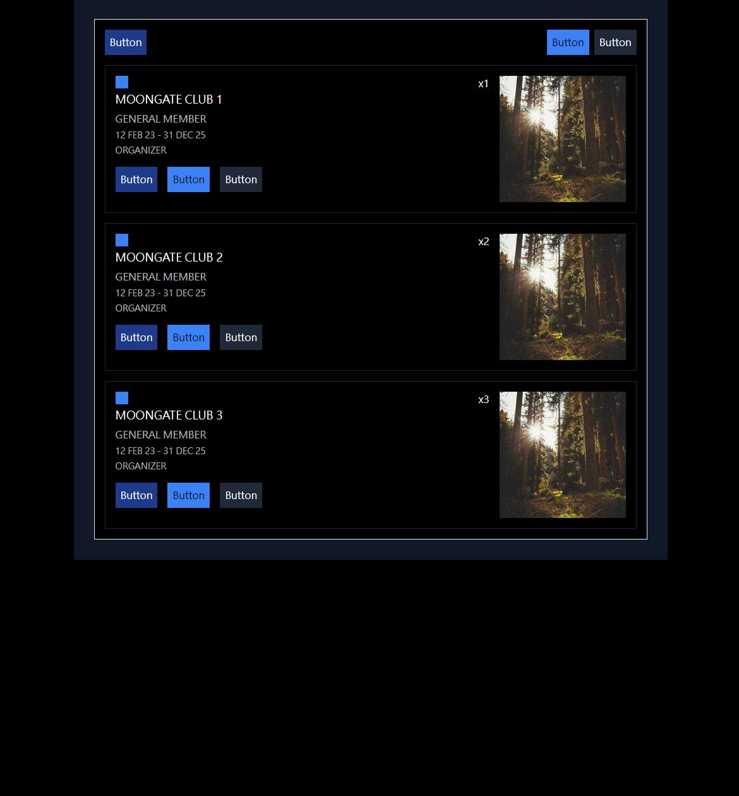
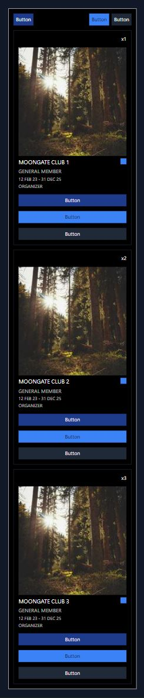
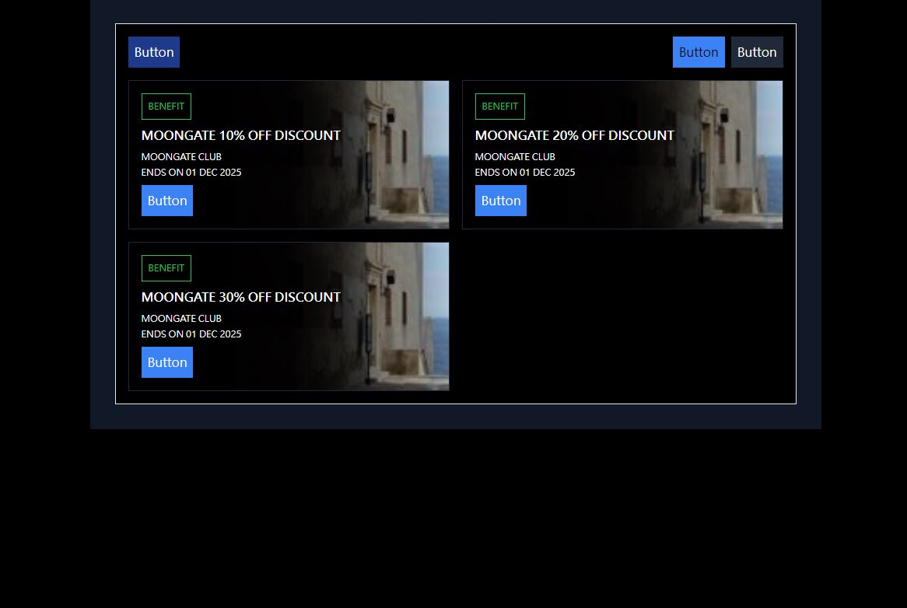
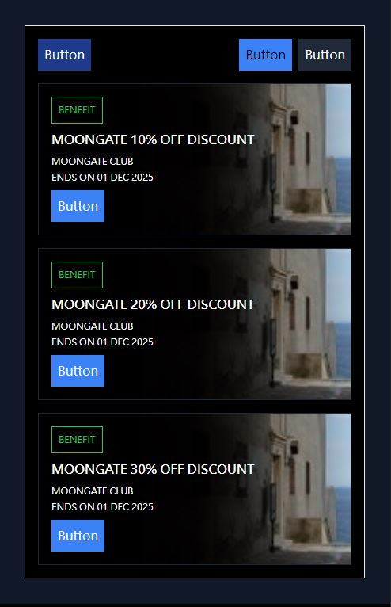

# Overview

Modify the given HTML templates to create a responsive website using [Tailwind CSS](https://tailwindcss.com/). Your submission should demonstrate your ability to craft responsive layouts using only CSS with a particular focus on mobile and desktop compatibility.

## Objectives

Create two main pages for a website, focusing on responsive design. Detailed expectations for desktop and mobile layouts are provided.

### 1. Page One

- Expected Desktop Layout

- Expected Mobile Layout

### 2. Page Two

- Expected Desktop Layout

- Expected Mobile Layout

### 3. **Bonus:** UI Design

- A user-friendly and aesthetically pleasing UI is a plus, but the primary focus is on responsiveness.

## Requirements

- **APPEND** Tailwind CSS class(es) to existing HTML element classes **ONLY**.
- **NO** additional HTML elements are allowed.
- Utilize `sm` as the breakpoint for responsive designs.
- Ensure webpages are responsive and adapt effectively to different screen sizes, with a focus on mobile devices.

## Evaluation Criteria

- Functionality: The site should work as expected on desktop and mobile devices.
- Responsiveness: Special emphasis on the site's fluid adaptation to various screen dimensions, particularly around the `sm` breakpoint.
- Code Quality: Code should be clean, well-organized, and follow best practices.
- UI Design (Plus, not primary): A user-friendly and aesthetically pleasing UI is a plus, but the primary focus is on responsiveness.
